# 📊 Diagramme de Classes - Consensus PBFT Résilient

Ce diagramme UML représente l'architecture des classes de mon projet. Il met en évidence la modularité entre la couche réseau (`network`), la couche consensus (`consensus`), le moteur cryptographique (`crypto`), la simulation byzantine (`byzantine`) et la gestion des métriques (`metrics`).

```mermaid
classDiagram
    class Main {
        +main(args: String[])
    }

    class NodeConfig {
        -int nodeId
        -int totalNodes
        -int f
        -int port
        -int metricsPort
        -String byzantineType
        -MapPeers peers
        +isLeader(view) boolean
        +getLeaderId(view) int
        +getPrepareQuorum() int
        +getCommitQuorum() int
    }

    class ECDSASigner {
        -KeyPair keyPair
        -int nodeId
        +sign(message: String) String
        +verify(message: String, signature: String, pubKey: PublicKey) boolean
        +getPublicKey() PublicKey
    }

    class ShamirThreshold {
        -int threshold
        -int totalShares
        +split(secret: BigInteger) ListShare
        +reconstruct(shares: ListShare) BigInteger
    }

    class TLSConfig {
        +createSSLContext() SSLContext
    }

    class NetworkManager {
        -ServerSocket serverSocket
        -MapSockets activeConnections
        -MapPublicKeys publicKeys
        +startServer()
        +connectToPeers()
        +broadcast(msg: Message)
        +sendTo(nodeId: int, msg: Message)
    }

    class MessageHandler {
        -PBFTEngine engine
        +handle(msg: Message)
    }

    class Message {
        -Type type
        -int senderId
        -int viewNumber
        -int sequenceNumber
        -String payload
        -String signature
        +toJson() String
        +fromJson(json: String) Message
    }

    class PBFTEngine {
        -NodeConfig config
        -NetworkManager network
        -ViewManager viewManager
        -MetricsCollector metrics
        -ByzantineBehavior byzantineBehavior
        -MapConsensusState consensusLog
        +start()
        +submitTransaction(payload: String)
        +onPrePrepare(msg: Message)
        +onPrepare(msg: Message)
        +onCommit(msg: Message)
    }

    class ConsensusState {
        -int sequenceNumber
        -int viewNumber
        -Phase phase
        -Message prePrepare
        -SetPrepare prepares
        -SetCommit commits
        +isPrepared(quorum: int) boolean
        +isCommitted(quorum: int) boolean
    }

    class ViewManager {
        -int currentView
        -int currentLeader
        -Timer timer
        +start(onViewChange: Runnable)
        +resetTimer()
        +onViewChangeReceived(senderId: int, view: int)
    }

    class ByzantineBehavior {
        <<interface>>
        +interceptMessage(msg: Message, net: NetworkManager) Message
    }

    class SilentNode {
        -int droppedCount
        +interceptMessage(msg: Message, net: NetworkManager) Message
    }

    class EquivocationNode {
        +interceptMessage(msg: Message, net: NetworkManager) Message
    }

    class ReplayNode {
        +interceptMessage(msg: Message, net: NetworkManager) Message
    }

    class MetricsCollector {
        -long startTime
        -AtomicInteger totalTx
        -ListLatencies latencies
        +recordTransactionExecuted(seq: int, latency: long)
    }

    class MetricsServer {
        -HttpServer server
        -MetricsCollector metrics
        +start()
    }

    %% Relations de dépendance et d'association
    Main --> NodeConfig : "initialise"
    Main --> PBFTEngine : "démarre"
    PBFTEngine --> NodeConfig : "utilise"
    PBFTEngine --> NetworkManager : "communique"
    PBFTEngine --> ViewManager : "gère les vues"
    PBFTEngine --> ConsensusState : "conserve l'historique"
    PBFTEngine --> MetricsCollector : "met à jour"
    NetworkManager --> MessageHandler : "délègue"
    MessageHandler --> PBFTEngine : "transmet"
    NetworkManager --> ECDSASigner : "signe/vérifie"
    PBFTEngine --> ByzantineBehavior : "applique l'attaque"
    ByzantineBehavior <|.. SilentNode : "implémente"
    ByzantineBehavior <|.. EquivocationNode : "implémente"
    ByzantineBehavior <|.. ReplayNode : "implémente"
    MetricsServer --> MetricsCollector : "lit"
```

