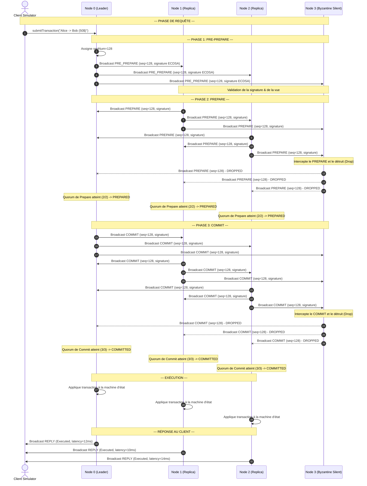

# 🔄 Diagramme de Séquence - Consensus PBFT Résilient

Ce diagramme illustre le flux de messages lors d'un cycle complet de consensus PBFT au sein d'un cluster à 4 nœuds. Il met en scène :
*   Le client soumettant une transaction au Leader (Nœud 0).
*   La phase de **Pre-Prepare** initiée par le Leader.
*   La phase de **Prepare** avec quorum de préparation $2f = 2$ votes.
*   La phase de **Commit** avec quorum de validation $2f + 1 = 3$ votes.
*   L'exécution finale et la réponse au client.
*   Le comportement du **Nœud 3 (Byzantin Silencieux)** qui intercepte et détruit ses messages.

